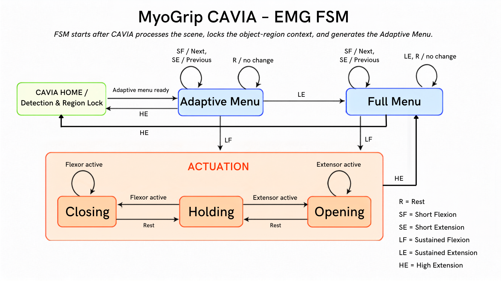
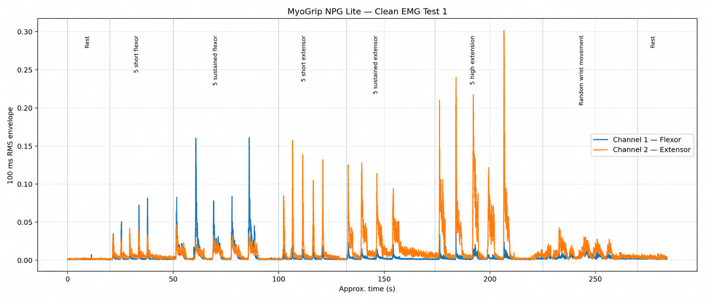

# MyoGrip CAVIA

**MyoGrip CAVIA** is a low-cost, EMG-controlled, tendon-driven assistive hand with **Context-Aware Visual Intent Arbitration**.

> This is a B.Tech assistive-engineering research prototype. It is not a medically certified prosthesis and must not be used as a safety-critical or clinical device.

## Why this project exists

Low-cost multi-grip hands often make the user cycle through every grip, while rigid vision systems can remove user choice by assigning one grip to an entire object. CAVIA uses vision to narrow the mechanically compatible choices, then keeps the user in control through deliberate EMG navigation and confirmation.

The research question is:

> Can preference-ranked, confidence-adaptive functional-region grip menus reduce EMG command burden and selection time without increasing incorrect choices or reducing perceived user control?

## MVP concept

1. A wrist-mounted camera observes a controlled set of daily-life objects.
2. A fixed centre reticle follows natural wrist pointing to select a functional grasp region.
3. Vision generates only grip candidates that the physical hand can execute at that region.
4. A lightweight per-user table ranks previously confirmed grips for the object-region pair.
5. Visual confidence and preference evidence determine whether the interface shows the full menu, the top two candidates, or a one-confirm shortcut.
6. The user navigates and confirms with surface EMG; the system never executes a grip automatically.
7. The embedded controller performs a calibrated servo sequence and enforces motion limits.

## Planned prototype

- Right-side 3D-printed tendon-driven hand
- Five positional MG996R servos through a PCA9685 driver
- Three-channel NPG Lite surface-EMG interface with built-in ESP32-C6
- Wrist-mounted XIAO ESP32-S3 Sense camera
- Laptop-based perception, CAVIA logic, visualization, and experiment logging
- Open, power/cylindrical, pinch, tripod, and lateral/support postures

### Servo assignment

| Servo | Function |
|---|---|
| 1 | Thumb opposition/orientation |
| 2 | Thumb flexion/closing |
| 3 | Index flexion |
| 4 | Middle flexion |
| 5 | Coupled ring-and-little flexion through a floating equalizer/whiffletree |

## Adaptive menu policy

| Evidence | Menu | User authority |
|---|---|---|
| Low confidence or no history | Full compatible menu | Navigate and confirm |
| Moderate confidence | Top two candidates | Navigate, expand, and confirm |
| High visual and preference confidence | One-confirm shortcut | Confirm deliberately or open the full menu |

The shortcut never triggers movement by itself, and the full menu remains accessible.

## Repository layout

```text
MyoGrip-CAVIA/
├── assets/figures/          # Approved project figures
├── data/emg/test-1/         # Raw EMG characterization data and notes
├── docs/                    # Current system architecture and design records
├── .gitattributes
├── .gitignore
└── README.md
```

## Current checkpoint

- Project concept and research scope defined
- Two-channel flexor/extensor characterization recording completed using NPG Lite
- Short and sustained contractions are visible in the 100 ms RMS envelopes
- Working EMG finite-state-machine diagram prepared
- Mechanical hand, embedded actuation, vision pipeline, and end-to-end CAVIA integration are not yet validated





## Status

Active development by a four-member B.Tech project team. Source code, CAD, calibration files, and evaluation scripts will be added as each subsystem is implemented and verified.
